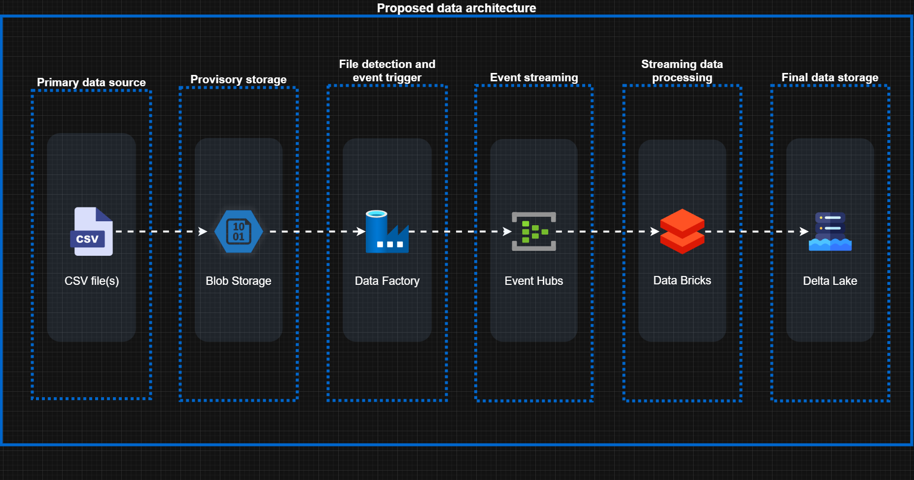

# ETL — Real-time streaming data pipeline

## 📄 Description
This project proposes the architecture of a **real-time ETL pipeline** using Azure services to ingest, stream, and store data in **Delta Lake**. Below is an illustration of the proposed architecture.



---

## Pipeline Workflow Overview

1. **Data Ingestion**
   - Input data arrives as `.csv` files.
   - Files are uploaded to a temporary landing zone in Azure Blob Storage.

2. **File Detection & Event Streaming**
   - Azure Data Factory (ADF) monitors Blob Storage for new files.
   - When a file is detected:
     - The file is read and split into batches.
     - Each batch is sent as an event to Azure Event Hubs.
     - The original file is deleted after successful transmission confirmation.

3. **Real-Time Stream Processing**
   - Azure Databricks Structured Streaming consumes events from Event Hubs in real time.
   - The streaming job processes records and writes them to Delta Lake, ensuring idempotency and avoiding duplicate writes.

---

## 🗂️ Project Structure
```
project-root/
│
├── src/
│   └── example_implementation.py    # Example/sugestion of Python implementation
│
├── architecture_flowchart.drawio    # Diagram in draw.io format to facilitate modifications
├── architecture_flowchart.png       # Diagram in png format to facilitate the view
└── README.md
```

---

## Features

- Event-driven data ingestion
- Real-time stream processing with Apache Spark
- Automated file detection, batching, and cleanup
- Idempotent writes to Delta Lake for data consistency
- Scalable architecture suitable for large datasets
- Monitoring and logging at all stages to detect failures

---

## Components Used

| Component | Purpose |
|----------|---------|
| Azure Blob Storage | Temporary landing zone for raw `.csv` files |
| Azure Data Factory | File detection and event trigger |
| Azure Event Hubs | Event streaming for real-time ingestion |
| Azure Databricks | Stream processing and writing to Delta Lake |
| Delta Lake | Final, optimized storage layer |

---

This ETL pipeline demonstrates a modern, robust, and scalable streaming architecture suitable for real-time analytics on cloud-based data platforms.

## 👤 Authors
- José Neto Souza (Jose-Nt)

---

## License
Free use permitted — attribution required.